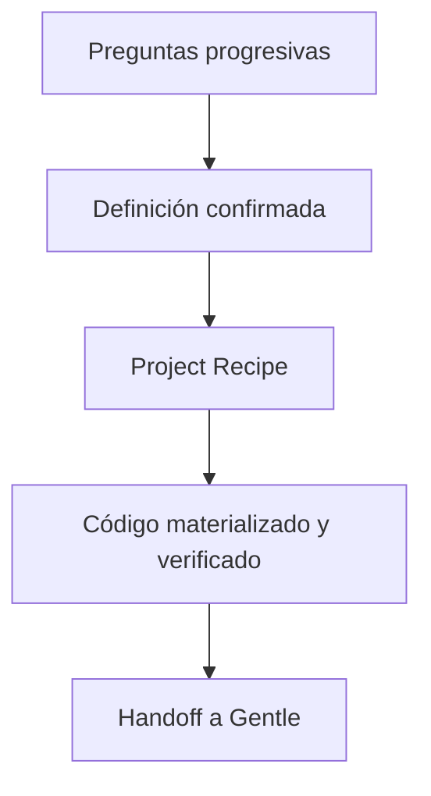

# Engineering Platform

Una base de ingeniería minimalista, práctica y opinionada para que una consultoría de **1 a 20 personas** inicie y mantenga proyectos sin volver a discutir el stack desde cero.

> Versión: **0.8.0** · Candidata a v1.0 · Revisión: **2026-09-01**

La idea es “Omarchy para proyectos”: pocos defaults buenos, comandos directos y automatización visible. No es un portal, un framework universal ni una colección de repositorios de moda.

## Qué resuelve

Un agente descubre la idea y la convierte en una **Project Recipe** reproducible:



La Recipe fija:

- Golden Path y versión;
- boilerplates y estrategia de actualización;
- perfil de base de datos;
- feature packs incluidos y excluidos;
- skills que el asistente debe cargar;
- quality gates que deben aportar evidencia;
- ownership de archivos para evitar sobrescrituras.

La misma automatización sirve a una persona y a veinte. Lo que cambia con el tamaño es la revisión humana, no la arquitectura de la plataforma.

## Inicio rápido con Pi

Requiere Pi, Python 3.11+ y los runtimes del Recipe elegido. Engineering ejecuta un preflight antes de descargar código; por ejemplo, API Starter exige Bun 1.4 y los starters web/móvil Node 24. Desde el ZIP o un checkout estable:

```bash
make check
./eng install --global --target pi
eng doctor --global
eng start school-requests
```

`eng start` crea `~/dev/school-requests`, entra ahí y abre Pi con el agente de descubrimiento. `ENG_WORKSPACE` o `--workspace` cambian la raíz. Si ya abriste Pi dentro de una carpeta vacía, usa `/new-project`.

La integración es un paquete Pi nativo: extensión TypeScript, skill de descubrimiento, los 13 skills operativos existentes y prompt de handoff. No modifica automáticamente la confianza de proyectos. Consulta [integración con Pi](docs/06-ai-harness/pi-integration.md).

El agente pregunta hasta confirmar problema, usuarios, alcance y restricciones; después genera:

- `.engineering/project-definition.json`: idea confirmada;
- `.engineering/project.json`: Recipe, stack, features, skills y gates;
- `.engineering/materialization.json`: fuentes exactas, pins, destinos, runtimes y checks ejecutados;
- `.github/workflows/engineering.yml`: CI raíz de los starters realmente instalados;
- `ARCHITECTURE.md` y `AGENTS.md`: estructura y reglas;
- `GENTLE.md`: handoff breve para Gentle; `.engineering/gentle-handoff.json` solo indexa las fuentes de verdad para agentes.

`eng new` conserva la ruta de **blueprint** para automatización sin código. El flujo Pi usa `eng bootstrap`: clona cada commit exacto o copia el starter interno, instala dependencias, ejecuta sus checks, inicia Git en `main` y genera el handoff desde la estructura real. `--skip-setup --skip-checks` deja el proyecto en `code-ready`; `eng check --run` lo verifica después. Si ya pasó el setup, `eng check --run` lo reutiliza; usa `--force-setup` para repetirlo. Una feature declarada queda marcada como `pending-implementation` hasta que el boilerplate o los checks aporten evidencia real.

## Ejemplo de decisión

Necesidad: “Una escuela necesita solicitudes internas, adjuntos y aprobación”.

| Dimensión | Resultado |
|---|---|
| Recipe | `GP-02@1.0.0` |
| Starters | `hono-api` + `tanstack-admin` |
| Datos | `postgresql-managed` |
| Features | `auth`, `rbac`, `audit`, `observability`, `files` |
| Skills | selector, bootstrap, autorización, datos y gates |
| Exclusiones | multitenancy, jobs y mobile hasta que exista una necesidad |
| Entrega actual | `materialized`: `services/api` + `apps/admin` |

## Catálogo sin duplicados

El catálogo anterior fue integrado, no descartado. Las 17 entradas y sus fichas se conservan en [`catalog/legacy-v1.2.3`](catalog/legacy-v1.2.3/README.md); el registro normalizado vigente es [`platform/boilerplates.json`](platform/boilerplates.json).

Cada entrada tiene dos estados independientes:

| Eje | Valores | Pregunta que responde |
|---|---|---|
| Decisión | default, alternative, specialized, experimental, reference, deprecated, rejected | ¿Conviene para este problema? |
| Entrega | catalog-only, pilot-ready, curated, released | ¿Qué tan reproducible y probado está? |

Para proponer una URL:

```bash
./eng boilerplate evaluate https://github.com/kriasoft/react-starter-kit
```

Resultado actual: `ALREADY_REGISTERED`. React Starter Kit conserva una sola entrada, pin al upstream revisado y actualización `merge-seed`. Si se observa un commit distinto:

```bash
./eng boilerplate evaluate \
  https://github.com/kriasoft/react-starter-kit \
  --observed-commit <commit>
```

El resultado pasa a `ALREADY_REGISTERED_REFRESH`, no a una entrada duplicada. El skill [`boilerplate-curator`](.opencode/skills/boilerplate-curator/SKILL.md) guía la inspección, comparación y registro completo.

## Golden Paths vigentes

| Recipe | Default | Canal |
|---|---|---|
| GP-01 Public Web | Stardrive | stable |
| GP-02 Admin Application | TanStack Admin + Hono API | stable |
| GP-03 Python Data | SpeedPy | stable |
| GP-04 Mobile | Ignite + Hono API | stable |
| GP-05 Desktop | Tauri UI | stable |
| GP-06 Multi-App | TanStack Admin + Hono API | stable |
| GP-07 Commercial SaaS | React Starter Kit | trial |
| GP-08 Governed AI Assistant | AI Assistant Starter | trial |

El resolver incluye alternativas, datos permitidos, features, skills, gates y exclusiones; esta tabla es solo el mapa rápido.

## Base de datos: perfiles, no marcas sueltas

- `postgresql-managed`: default estable para backends multiusuario.
- `sqlite-local`: default estable para escritorio/local.
- `turso-libsql`: trial para casos edge/libSQL explícitos.
- `turso-sync`: experimental para replicas y sync diseñado.
- `turso-database`: experimental; nunca default sin piloto.

Así Turso se evalúa por capacidad y riesgo, no como reemplazo global de PostgreSQL.

## Comandos del ciclo de vida

| Comando | Utilidad |
|---|---|
| `eng catalog` | Consulta estados, categoría y cobertura |
| `eng boilerplate evaluate` | Detecta duplicado, refresh o candidata |
| `eng boilerplate verify` | Verifica pin, adapter, evidencia y referencias |
| `eng boilerplate add/remove` | Planea altas o bajas; `--apply` modifica el registro |
| `eng recommend` | Resuelve intake a Recipe sin escribir |
| `eng new` | Crea manifest y documentos del proyecto |
| `eng bootstrap` | Convierte una definición confirmada en proyecto y handoff |
| `eng start` | Crea `workspace/proyecto` y abre Pi dentro de esa carpeta |
| `eng install` | Instala globalmente el paquete Pi y el launcher `eng` |
| `eng uninstall` | Retira Pi y todas las copias versionadas gestionadas |
| `eng doctor` | Detecta divergencia e ids inválidos |
| `eng handoff` | Regenera las instrucciones para Gentle AI |
| `eng plan` | Selecciona skills y gates por tipo de cambio |
| `eng check` | Selecciona gates según manifest y archivos |
| `eng add` | Registra una capacidad y su trabajo pendiente; no inventa implementación |
| `eng extend` | Incorpora otro starter en una ruta libre, con dry-run predeterminado |
| `eng update` | Inspecciona pins y declara la estrategia; la actualización exige revisión |

## Modelo de equipo

| Tamaño | Operación |
|---|---|
| 1 persona | El manifest sustituye decisiones recordadas de memoria; el autor revisa excepciones |
| 2–5 | Un responsable revisa cambios de Recipe o starter; cambios normales siguen el manifest |
| 6–12 | Owners por Tier A y revisión cruzada de plataforma; proyectos conservan autonomía |
| 13–20 | Rotación de mantenimiento y ventana de upgrades; sin comité para tareas normales |

No se necesita Backstage, base de datos de inventario ni servicio siempre encendido. Esa complejidad solo se justificaría cuando exista fleet real que el repositorio y la automatización ya no puedan observar.

## Fuentes de verdad

- [`platform/boilerplates.json`](platform/boilerplates.json): candidatos, aliases, estados e integración.
- [`platform/golden-paths.json`](platform/golden-paths.json): Project Recipes.
- [`platform/database-profiles.json`](platform/database-profiles.json): decisiones de datos.
- [`platform/feature-packs.json`](platform/feature-packs.json): capacidades componibles.
- [`skills/registry.json`](skills/registry.json): skills reales y rutas.
- `.engineering/project.json`: estado instalado de cada proyecto.

## Estructura

```text
platform/       registros y Recipes legibles por máquina
schemas/        contratos JSON
catalog/        fichas y memoria histórica
curation/       pins y adapters reproducibles
.opencode/      skills del asistente
extensions/     comandos nativos de Pi
pi-skills/      descubrimiento cargado bajo demanda por Pi
prompts/        comandos de prompt del paquete Pi
feature-packs/  contratos de capacidades opcionales
upgrades/       actualización por estrategia upstream
examples/       intakes y proyectos canónicos
evals/          tareas de evaluación
scripts/        CLI y validación
tests/          pruebas del resolver y curador
docs/           guías humanas y decisiones
```

## Validación

```bash
make check
```

El validator comprueba el paquete Pi, JSON, aliases, URLs duplicadas, referencias entre Recipes/boilerplates/datos/features/skills, pins, adapters, schemas y enlaces Markdown. Las pruebas ejercitan instalación aislada, rutas seguras, definición confirmada, resolución, handoff, extensión, compatibilidad y doctor. El workflow `release-pilots` materializa y verifica semanalmente los seis Recipes estables, conservando sus `.engineering` como evidencia descargable.
