# Mapa del catálogo

```mermaid
flowchart TD
    P[Presencia pública] --> Stardrive[Stardrive]
    A[Aplicaciones operativas web] --> TanStack[TanStack Shadcn Admin Dashboard<br/>default]
    A --> Next[Next Shadcn Admin Dashboard<br/>híbrido público + privado]
    Py[Python, datos y documentos] --> SpeedPyFull[SpeedPy Full]
    Py --> SpeedPyLite[SpeedPy Lite<br/>interno]
    Py --> FastAPI[Full Stack FastAPI Template<br/>API-first]
    Py --> PyService[Python Service Starter<br/>servicio aislado]
    C[Canales instalables] --> Ignite[Ignite<br/>móvil]
    C --> Tauri[Tauri UI<br/>escritorio]
    S[SaaS comercial] --> OpenSaaS[Open SaaS<br/>piloto Wasp]
    S --> RSK[React Starter Kit<br/>TypeScript full-stack, edge Cloudflare]
    IA[IA] --> Chatbot[Vercel Chatbot<br/>upstream de UI/producto]
    IA --> AIAssistant[AI Assistant Starter<br/>interno]
    IA --> SelfHosted[Self-hosted AI Starter Kit<br/>infraestructura POC]
    Inst[Institucional] --> IO[Institutional Operations Starter<br/>interno, activo estratégico]
    Esp[Especializado] --> GoShip[GoShip<br/>turnos, SSE, PWA, webhooks]
```

## Defaults

- Público: Stardrive.
- Dashboard operativo: TanStack Start.
- Datos/proceso Python: SpeedPy.
- API Python multicanal: Full Stack FastAPI.
- Móvil: Ignite.
- Escritorio: Tauri UI.

Los demás se activan por una condición concreta, no por preferencia personal.
