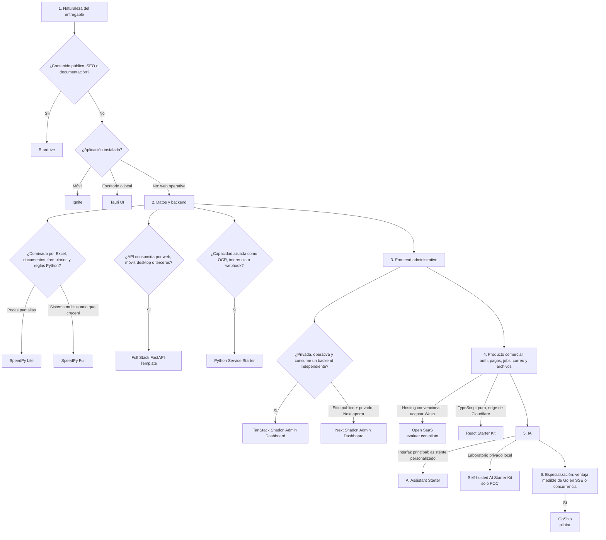

# Árbol de decisión

> [!IMPORTANT]
> Pregunta final obligatoria: ¿esta elección reduce complejidad total, o solo mueve la complejidad a otro framework? Si no puede responderse, crear un ADR y hacer un spike antes de adoptar.

## 1. Naturaleza del entregable

### ¿El valor principal es contenido público, SEO o documentación?

Usar **Stardrive**.

### ¿Es una aplicación instalada?

- Móvil: **Ignite**.
- Escritorio/local: **Tauri UI**.

### ¿Es una aplicación web operativa?

Continuar.

## 2. Datos y backend

### ¿El problema está dominado por Excel, documentos, formularios y reglas Python?

- Pocas pantallas y poca infraestructura: **SpeedPy Lite**.
- Sistema multiusuario que crecerá: **SpeedPy Full**.

### ¿La API será consumida por web, móvil, desktop o terceros?

Usar **Full Stack FastAPI Template** o su perfil backend-only.

### ¿Es una capacidad aislada como OCR, inferencia o webhook?

Usar **Python Service Starter**.

## 3. Frontend administrativo

### ¿La aplicación es privada, operativa y consume un backend independiente?

**TanStack Shadcn Admin Dashboard**.

### ¿Sitio público y app privada deben convivir y Next aporta capacidades específicas?

**Next Shadcn Admin Dashboard**.

## 4. Producto comercial

### ¿Se requiere auth, pagos, jobs, correo y archivos desde el inicio?

- Hosting convencional y aceptar Wasp: evaluar **Open SaaS** mediante piloto.
- Stack TypeScript puro y aceptar edge de Cloudflare: **React Starter Kit**.

## 5. IA

### ¿La interfaz principal será un asistente personalizado?

Usar **AI Assistant Starter**, derivado de Vercel Chatbot.

### ¿Se requiere un laboratorio privado local?

Usar **Self-hosted AI Starter Kit** solo para POC.

## 6. Especialización

### ¿Existe una ventaja medible de Go en SSE, concurrencia o footprint?

Pilotar **GoShip**.
