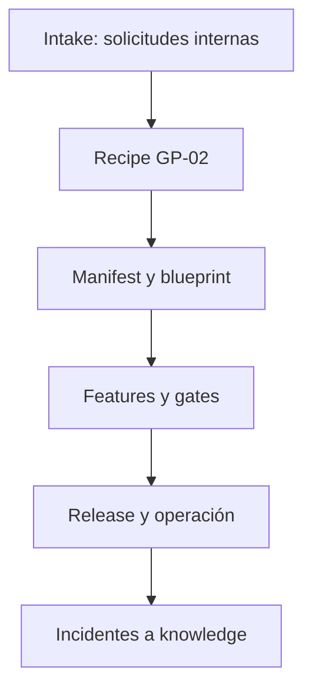

# Ciclo de vida — ejemplo resumido

Cada fase tiene un artefacto verificable. `eng doctor`, `eng plan` y `eng check` acompañan el proyecto después del bootstrap; no depende de memoria oral del equipo.
